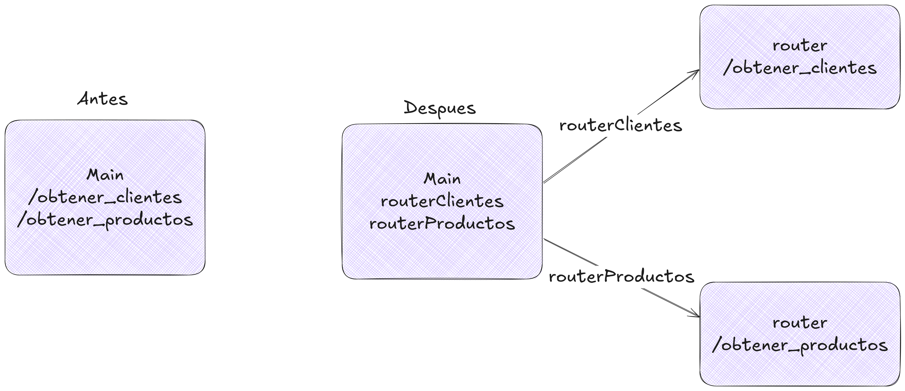

# FastAPI + Supabase

En este repositorio se encontrará el código base y de ejemplo para la tarea del **Laboratorio de Programación III**; Este repositorio tiene el funcionamiento básico de _routers y manejadores_ divididos en la siguiente estructura de carpetas:

```
├── managers
│   ├── clientesManager.py
│   ├── conexionManagerSupabase.py
│   ├── conexionManager.py
│   ├── pedidosManager.py
│   └── productosManager.py
├── models
│   └── models.py
├── routes
│   ├── clientRouter.py
│   ├── pedidoRouter.py
│   └── productoRouter.py
├── README.md
├── .env
└── main.py
```

En _models_ encontramos los modelos pydantic.
En _routes_ encontramos los routers para los endpoints y la separación del main.
En _managers_ encontramos la lógica de cada uno de los routers (clientes, productos, pedidos y la conexión). La lógica se encuentra encapsulada en una clase. Por ejemplo: **ClientesManager**

# Creación de requirements.txt

Para que Vercel (u otro servidor de deploy) pueda reconocer e instalar las dependencias específicas de nuestro proyecto es necesario crear este archivo de requerimientos donde expliquemos cuales son las dependencias que utiliza nuestro proyecto. Para ello, en la raiz de nuestro proyecto con **el entorno activado** procedemos a escribir en la terminal:

```bash
    pip freeze > requirements.txt
```

esto genera que la salida del pip freeze (todas las dependencias del proyecto) se escriban dentro de un archivo requirements.

# Aclaraciones sobre Supabase

En la estructura de archivos toda la lógica está pensada para usar FastAPI con Supabase. Por eso, en los imports se verá **psycopg** como libreria en vez de **sqlite3**. Sin embargo, en los managers se encuentra un archivo llamado conexionManager que es el que tiene la lógica para el despliegue de la API con sqlite. El que se encuentra implementado es el que se llama conexionManagerSupabase, el cual contiene la lógica para este servicio.

## Algunas diferencias entre sqlite3 y pyscopg en el código

Entre las pocas diferencias que podemos encontrar es que en sqlite los parametros de la query se escriben con "?" en cambio, en psycopg (postgres) se usan con "%s".

Ejemplo: **Psycopg (postgres)**

```python
idCliente = cursor.execute(
            "SELECT id_cliente FROM cliente WHERE nombre = (%s)", (nombre,)
        ).fetchone()
```

Ejemplo: **SQLite3**

```python
idCliente = cursor.execute(
            "SELECT id_cliente FROM cliente WHERE nombre = (?)", (nombre,)
        ).fetchone()
```

## Supabase y variables de entorno

Cuando desarrollamos existen credenciales, valores o información, que son importantes para nuestro programa o aplicacion y que no debemos exponerlas al público para evitar conflicos, robos de data, etc. Para ello, una medida que tenemos como desarrolladores son las variables de entorno. Estas variables se generan dentro de un archivo _.env_ el cual **no** mandamos a producción (deploy del proyecto).

### Dotenv y las variables de entorno

Para hacer uso de dichas variables generamos un archivo .env y dentro ponemos nuestras variables, por lo general, en mayúsculas. Ejemplo: CLAVE_DB="asdsad"
Luego es necesario instalar dotenv.

```bash
pip install python-dotenv
```

Una vez instalado hacemos uso de la siguiente forma en el código:

```python
import  os
from  dotenv  import  load_dotenv

load_dotenv()
passwordDB  =  os.getenv("CLAVE_DB")
```

### Psycopg

Para poder hacer uso de Supabase y su base de datos es necesario instalar la dependencia Psycopg que actua como intermediario para el manejo de Postgres.

```bash
pip install "psycopg[binary]"
```

# Uso de routers para simplificar el main.py

Cuando nuestra API empieza a crecer en endpoints es necesario que dividamos las responsabilidades en diferentes archivos. En nuestro caso, creamos un router para cada grupo de rutas: _clientes, pedidos y productos_ estos se encuentran dentro de /routes/clientRouter.py, etc.

### **¿Como funciona un router**?

El router en principio parece agregar complejidad innecesaria. Pero la división de las responsabilidades permite que podamos trabajar de forma modular y facilitar la depuración de errores o la escalabilidad de nuestra aplicación ya que nuestros endpoints crecerán dentro de su sección y no en el main.



Ejemplo: sin router main.py

```python
app = FastAPI()

@app.post("/crear_pedido")
def postPedido(pedido: PedidoModel, cursor: psycopg.Cursor = Depends(getCursor)):
    res = PedidoManager.addPedido(pedido, cursor)
    return {"msg": res}

@app.post("/crear_productos")
def postProductos(producto: ProductoModel, cursor: psycopg.Cursor = Depends(getCursor)):
    res = ProdManager.addProducto(producto, cursor)
    return {"msg": res}

...
```

Ejemplo: con router main.py

```python
app.include_router(routerClient)
app.include_router(routerProducts)
app.include_router(routerPedidos)
```

clientRouter.py

```python
router = APIRouter(prefix="/clientes", tags=["Clientes routes"])
clientManager = ClienteManager()


@router.get("/obtener_clientes")
def getClientes(cursor: psycopg.Cursor = Depends(getCursor)):
    res = clientManager.getClientes(cursor)
    return res
```

# Endpoints que tiene la API

- [x] /obtener_clientes.
- [x] /obtener_cliente/{id}
- [x] /modificar_cliente/{id}
- [x] /eliminar_cliente/{id}
- [x] /crear_pedido
- [x] /obtener_pedidos
- [x] /obtener_pedido/{id}
- [x] /obtener_pedido_por_cliente/{nombre}
- [x] /obtener_productos
- [x] /crear_productos

- [ ] Modificar producto
- [ ] Eliminar producto
- [ ] Total por pedido
- [ ] Filtrar pedido por cliente
- [ ] FIltrar pedido por fecha (opcional)
